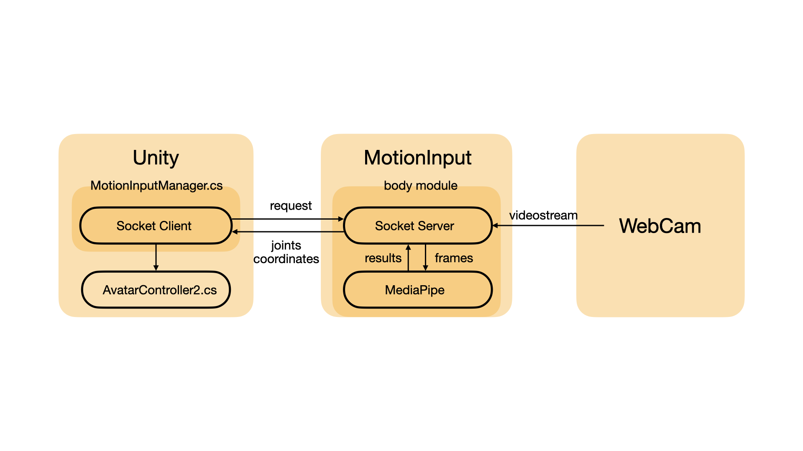

# Documentation
## Video Demonstration
https://www.youtube.com/watch?v=mxQvLYzM7aA
## Architecture

## Example WorkFlow(for sample project):
1. Download main.exe from here: https://liveuclac-my.sharepoint.com/:u:/r/personal/ucaboua_ucl_ac_uk/Documents/main.exe?csf=1&web=1&e=Bi8cDs
2. Disable Kinect-related script(including KinectManager.cs, AvatarController.cs) in the scene.
3. Add 'MotionInputManager.cs' to 'Main Camera' in the scene.
4. Add 'AvatarController2.cs' to 'U_CharacterBack'.
5. Run 'main.exe' outside Unity;
6. Click 'Play' in Unity;
## Explanations
### Executable - main.exe
1. This program will be reading frames from webcam, processing frames, calculating orientation values and joining them into a local string.
2. Meanwhile, after setting up a local server(port:7788), it will keep listening to any request via socket and respond with the encoded local string(in utf8).
### Unity Script - MotionInputManager.cs
This script should be attached to any object in the scene, for example 'Main Camera'. It works similar as KinectManager. But it will first call socket api to send request to the local server(by the main.exe). After receiving the response, it will decode 
the data and derive joint orientations(axis aligned with Unity world coordinate). It also provides a method that return specific joint values. 
### Unity Script - AvatarController2.cs
This script should be attached to the Avatar(facing z-axis in world coordinate system). It will keep calling MotionInputManager to get orientation values and update the bones orientations.
